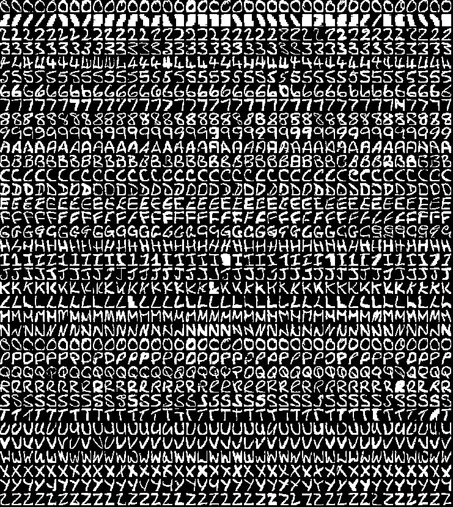
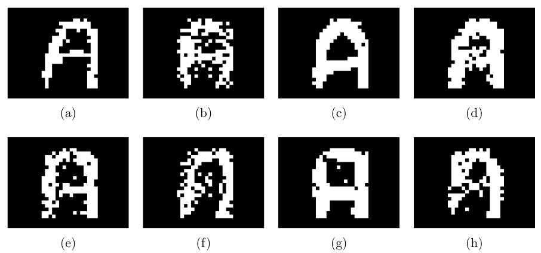
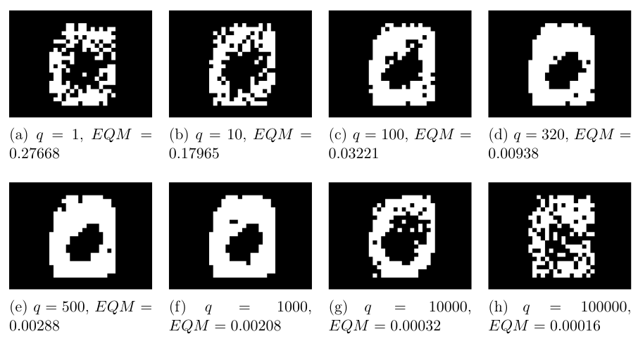
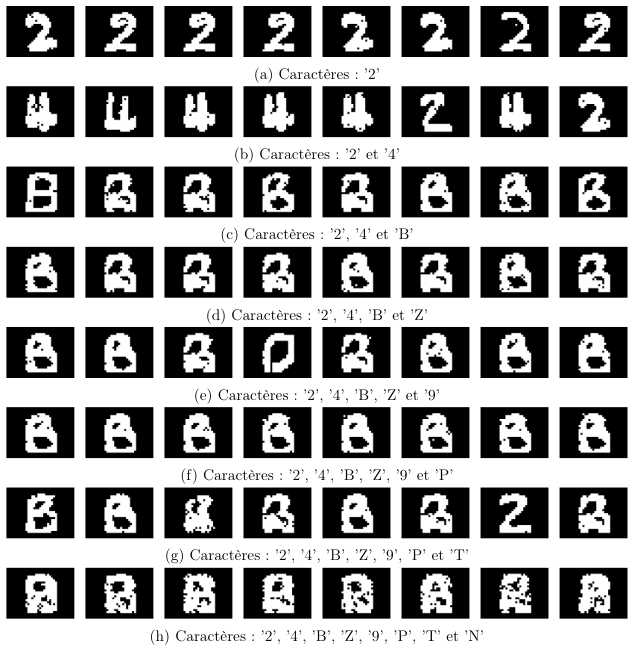
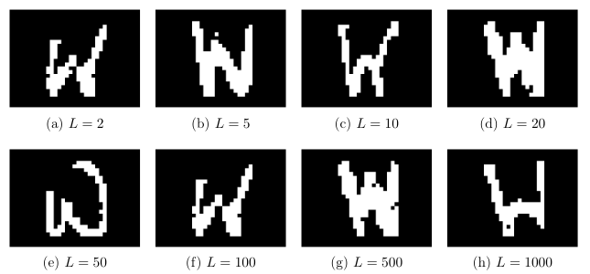
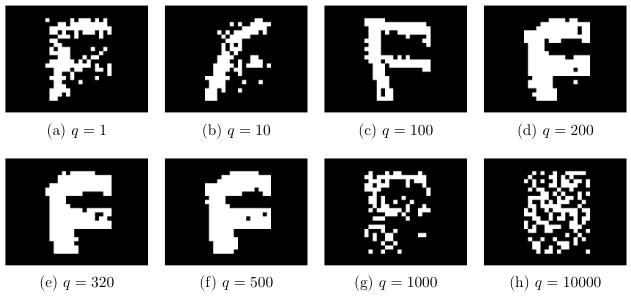
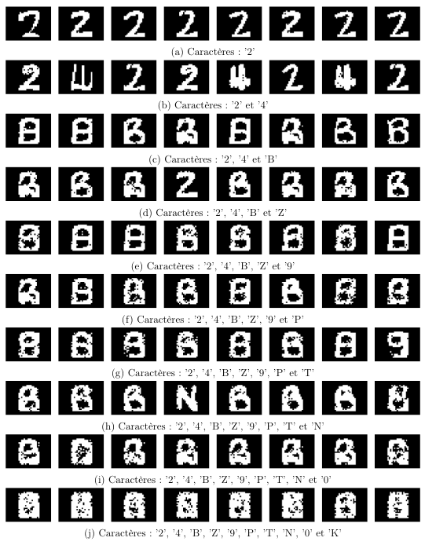
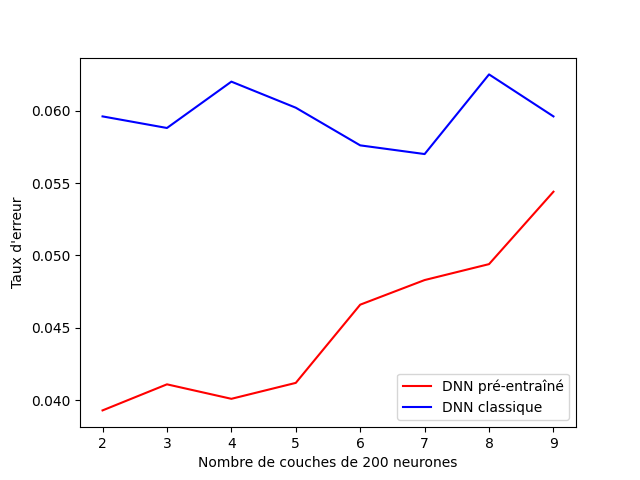
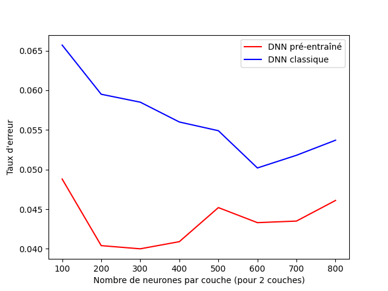
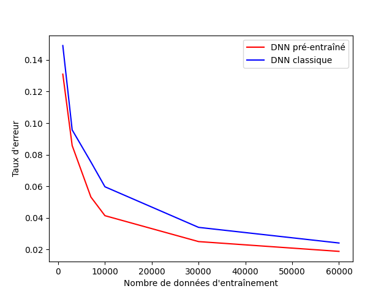

# Coder un *Deep Neural Network* (DNN) avec la librairie numpy

L'objectif de ce projet est d'implémenter un réseau de neurones profond (DNN) et de comparer un DNN pré-entraîné avec un DNN entraîné normalement sur le jeu de données MNIST. L'objectif final est donc de pouvoir classer correctement les images manuscrites des nombres de 0 à 9.

## Table des matières

- [1 Binary AlphaDigits](#1-binary-alphadigits)
   - [1.1 Restricted Boltzmann Machine](#11-restricted-boltzmann-machine)
      - [1.1.1 Impact du nombre de neurones](#111-impact-du-nombre-de-neurones)
      - [1.1.2 Impact du nombre de caractères à apprendre](#112-impact-du-nombre-de-caractères-à-apprendre)
   - [1.2 Deep Belief Network](#12-deep-belief-network)
      - [1.2.1 Impact du nombre de couches](#121-impact-du-nombre-de-couches)
      - [1.2.2 Impact du nombre de neurones](#122-impact-du-nombre-de-neurones)
      - [1.2.3 Impact du nombre de caractères à apprendre](#123-impact-du-nombre-de-caractères-à-apprendre)
- [2 MNIST et Deep Neural Network](#2-mnist-et-deep-neural-network)
   - [2.1 Impact du nombre de couches](#21-impact-du-nombre-de-couches)
   - [2.2 Impact du nombre de neurones](#22-impact-du-nombre-de-neurones)
   - [2.3 Impact du nombre de données d’entraînement](#23-impact-du-nombre-de-données-dentraînement)
   - [2.4 Recherche de la meilleure configuration](#24-recherche-de-la-meilleure-configuration)
- [3 Conclusion](#3-conclusion)
- [4 Exécuter le code](#4-exécuter-le-code)


## 1 Binary AlphaDigits

<figure>
  
  <figcaption align="center"><strong>Figure 1</strong> - Base de données Binary AlphaDigits.</figcaption>
</figure>

Dans cette section, les modèles seront entraînés et testés sur la base de données Binary AlphaDigits (figure 1) qui est composée de 36 caractères (chiffres de 0 à 9 et lettres
de A à Z) en 39 exemplaires chacun. Les images sont de dimensions 20X16 et seront in-
troduites dans les modèles comme des vecteurs de taille 320. L’objectif de cette partie
est d’investiguer la puissance générative et les limites des modèles Restricted Boltz-
mann Machine (RBM) et Deep Belief Network (DBN) dans un cadre d’apprentissage
non-supervisé.

### 1.1 Restricted Boltzmann Machine

Pour commencer, on décide de tester le RBM dans un cas simple où on lui demande
de générer un seul caractère. Prenons par exemple le caractère 'A' pour différentes
configurations des paramètres du modèle.
A l’aide de la figure 2, on peut déjà se faire une idée de l’influence de chaque
paramètre d’un RBM. On voit bien qu’ils ont tous un impact sur la capacité du modèle
à reconstruire l’image. Par exemple, la taille de la couche de sortie (appelée aussi couche
cachée) a visuellement un impact. Prenons l’image 2.(b), pour laquelle, le caractère 'A' est très mal reproduit pour `q=10` et de même pour `q=10000` (2.(d)). On peut
donc en déduire qu’une taille idéale pour la couche cachée se situera entre `q=100`
et `q=1000`. On peut mener la même réflexion sur les autres paramètres tels que `lr`
(le learning rate ou taux d’apprentissage de la descente de gradient), `batch_size` (la
taille des paquets de données), `epochs` (le nombre d’itération pour l’entraînement du
RBM) et `nb_iter_gibbs` (le nombre d’itération pour l’échantilloneur de Gibbs lors de la génération de l’image). Ainsi, pour simplifier l’étude, on se concentrera principalement sur le nombre de neurones (la taille de la couche cachée `q`) et le nombre de caractères à apprendre. Les autres paramètres seront fixés comme dans la figure 2.(a) avec `epochs=100`.


<figure>
  
  <figcaption><strong>Figure 2</strong> - Plusieurs générations du caractère 'A' par différents modèles RBM. Le modèle (a) est le basique avec <code>p=320</code>, <code>q=200</code>, <code>batch_size=5</code>, <code>lr=0.1</code>, <code>epochs=20</code>, <code>nb_iter_gibbs=50</code>. Le modèle (b) est une variante de (a) avec <code>q=10</code>. De même, (c) avec <code>q=1000</code>, (d) avec <code>q=10000</code>, (e) avec <code>lr=1</code>, (f) avec <code>batch_size=15</code>, (g) avec <code>epochs=100</code> et (h) avec <code>nb_iter_gibbs=200</code>. Pour ces générations, les modèles ont tous été entraînés sur 39 images.</figcaption>
</figure>


#### 1.1.1 Impact du nombre de neurones

Pour commencer, fixons le nombre de caractères à 1 et investiguons sur le nombre de neurones idéal, c’est-à-dire pour lequel le modèle génère bien. Pour avoir le nombre optimal de neurones, on pourrait tester exhaustivement les performances de génération pour tous les entiers entre 1 et 100,000. Pour plus de facilité, on étudiera par ordre de grandeur. La figure 3 illustre cette recherche pour la génération du caractère ‘0’ (zéro). On remarque que les meilleures générations sont pour q = 320, q = 500 et q = 1000. Ce qui est plus étonnant, c’est la décroissance de l’EQM à la 100ième itération (dans la descente de gradient de l’algorithme d’entraînement) même lorsque l’image reconstruite n’est visuellement pas meilleure. Prenons par exemple la figure 3.(h) qui possède l’EQM le plus faible (égal à 0.00016) et pourtant qui correspond à la génération la plus mauvaise car on aperçoit difficilement la forme ovale caractéristique du zéro. On en déduit, que l’EQM à la 100ième itération n’est pas un bon indicateur de performance. Par la suite, nous ne l’utiliserons plus et nous nous focaliserons sur le visuel de l’image générée.

<figure>
  
  <figcaption><strong>Figure 3</strong> - Plusieurs générations du caractère ‘0’ par différents modèles RBM. Pour ces images, les modèles ont tous été entraînés sur 39 images de ‘0’. Les paramètres sont fixés à :<code>p = 320</code>,<code>batch_size = 5</code>,<code>lr = 0.1</code>,<code>epochs = 100</code>,<code>nb_iter_gibbs = 50</code>. Le paramètre qui change ici est le nombre de neurones <code>q</code> qui varie de la figure (a) à (h) de 1 à 100,000 en passant par : 1, 10, 100, 320, 1000, 10000 et 100000. Les valeurs d’écart quadratique moyen (EQM) données correspondent à l’EQM (entre images vraies et reconstruites) à la 100ième itération de la descente de gradient pendant l’entraînement.</figcaption>
</figure>

#### 1.1.2 Impact du nombre de caractères à apprendre

D’autre part, on fixe le nombre de neurones à <code>q = 500</code> et on fait varier le nombre de caractères à apprendre. La figure 4 illustre cette étude. On remarque qu’à partir de 4 caractères à apprendre le RBM a du mal à générer un caractère clairement identifiable. En effet, à partir de l’image 4.(d), on hésite sur l’identification du caractère généré. On peut aussi supposer que la qualité de génération dépend du choix des caractères à prédire. Par exemple, si on demande au modèle d’apprendre les caractères ‘2’, ‘S’ et ‘5’ qui sont très semblables, cela lui demandera moins d’"efforts" car les distributions sont proches. Finalement, on peut en déduire que la limite d’apprentissage du RBM est de 3 caractères. Pour conclure, sur cette partie RBM, on peut affirmer que chaque paramètre joue un rôle important dans la qualité de génération d’une image. Le nombre de neurones idéal se situe aux alentours de 500 et le nombre maximal de caractères que le RBM peut apprendre est de 3. Cette limite assez restreinte de 3 caractères nous amène à développer un modèle plus complexe, qui, on l’espère, sera en mesure d’apprendre plus de caractères.

<figure>
  
  <figcaption><strong>Figure 4</strong> - Plusieurs générations d’images de RBM pour un nombre de caractères à apprendre qui varie de 1 à 8. Les modèles ont tous les mêmes paramètres : <code>p = 320</code>,<code>q = 500</code>,<code>batch_size = 5</code>,<code>lr = 0.1</code>,<code>epochs = 100</code>,<code>nb_iter_gibbs = 50</code>. Le paramètre qui change ici est le nombre de caractères à apprendre qui varie de la figure (a) à (h) de 1 à 8.</figcaption>
</figure>

### 1.2 Deep Belief Network

Maintenant que nous avons étudié les capacités génératrices et les limites du RBM, nous nous proposons de faire de même avec le Deep Belief Network (DBN). Le DBN peut se voir comme une généralisation du RBM. En effet, au lieu d’avoir une seule variable latente (variable cachée) on se fixe un nombre de variables latentes <code>L</code> afin de faire de la génération de données. Dans un DBN, on se place encore dans un cadre d’apprentissage non-supervisé. De plus, un DBN peut se voir informatiquement comme un empilement de RBM et c’est de cette manière que nous l’avons implémenté. L’objectif de cette partie est donc d’étudier trois paramètres : le nombre de neurones, le nombre de couches (égale au nombre de variables latentes <code>L</code>) et le nombre de caractères à apprendre.

<figure>
  
  <figcaption><strong>Figure 5</strong> - Plusieurs générations d’images pour un nombre de couches du DBN qui varie. Le nombre de neurones par couche est constant et égal à 500. De même, le caractère à apprendre est unique : ‘W’. Les RBM constituant le DBN ont tous les mêmes paramètres : <code>q = 500</code>,<code>batch_size = 5</code>,<code>lr = 0.1</code>,<code>epochs = 100</code>,<code>nb_iter_gibbs = 50</code>.</figcaption>
</figure>


#### 1.2.1 Impact du nombre de couches

Pour étudier la qualité de génération en fonction du nombre de couches, on se placera dans un cas simple avec le même nombre de neurones par couche : <code>q_1 = ... = q_L = 500</code>. De plus, on apprendra un seul caractère pour réduire le nombre de possibilités, l’objectif étant d’avoir un ordre d’idée du nombre idéal de couches. La figure 5 n’est pas très concluante car visuellement les images générées pour <code>L = 2</code> ou pour <code>L = 100</code> couches sont toutes d’assez bonne qualité car on arrive à identifier le caractère à apprendre : ‘W’. Malgré que pour <code>L = 500</code> et <code>L = 1000</code> la qualité de génération commence à se détériorer, le caractère est toujours reconnaissable. Ainsi, si la profondeur du DBN (c’est-à-dire son nombre de couches) n’a presque aucun impact, alors la solution optimale serait le DBN le moins profond afin de réduire les coûts de calcul. Cependant, nous n’avons pas essayé de faire varier les autres paramètres. Pour la suite, nous prendrons un nombre de couches raisonnable <code>L = 5</code>.

#### 1.2.2 Impact du nombre de neurones

Après avoir étudié le nombre de couches dans le DBN, il est temps d’analyser le nombre de neurones par couche. Pour simplifier l’étude, on se place dans le même cas que précédemment, c’est-à-dire que toutes les couches ont le même nombre de neurones : <code>q_1 = ... = q_L = q</code>. On voit sur la figure 6, que pour <code>L = 5</code>, le nombre de neurones optimal semble se trouver entre <code>q = 100</code> et <code>q = 1000</code> (comme pour le RBM). En-dessous de <code>q = 100</code> et au-dessus de <code>q = 1000</code>, les images générées ne sont pas d’assez bonne qualité car le caractère ‘F’ n’est pas clairement identifiable. Ainsi, pour des raisons de coût de calcul, nous prendrons pour la suite <code>q = 500</code>.

<figure>
  
  <figcaption><strong>Figure 6</strong> - Plusieurs générations d’images pour un nombre de neurones par couche qui varie. Le nombre de couches est constant et égal à <code>L = 5</code>. De même, le caractère à apprendre est unique : ‘F’. Les RBM constituant le DBN ont tous les mêmes paramètres : <code>batch_size = 5</code>,<code>lr = 0.1</code>,<code>epochs = 100</code>,<code>nb_iter_gibbs = 50</code>.</figcaption>
</figure>


#### 1.2.3 Impact du nombre de caractères à apprendre

Maintenant, on se place dans un DBN avec <code>L = 5</code> couches et <code>q_1 = ... = q_L = 500</code> neurones par couche. L’objectif est d’observer l’impact du nombre de caractères à apprendre sur la qualité de génération des images.

La figure 7 nous permet de visualiser les générations du DBN pour un nombre de caractères à apprendre qui varie de 1 à 10. En comparaison avec le RBM (qui a été testé sur les mêmes caractères de 1 à 8), le DBN s’en sort mieux pour un plus grand nombre de caractères à apprendre. On peut dire sur la figure 7, que jusqu’à 5 caractères à apprendre, les images générées sont reconnaissables. Ainsi, le DBN est meilleur que le RBM en termes de capacité à apprendre différents caractères.

<figure>
  
  <figcaption><strong>Figure 7</strong> - Plusieurs générations d’images de DBN pour un nombre de caractères à apprendre qui varie de 1 à 10. Le nombre de neurones par couche est constant et égal à <code>q = 500</code>. De même, le nombre de couches est constant et égal à <code>L = 5</code>. Les RBM constituant le DBN ont tous les mêmes paramètres : <code>q = 500</code>, <code>batch_size = 5</code>, <code>lr = 0.1</code>, <code>epochs = 100</code>, <code>nb_iter_gibbs = 50</code>.</figcaption>
</figure>

## 2 MNIST et Deep Neural Network

Dans cette section nous nous concentrerons principalement sur le test du Deep Neural Network (DNN). Ce modèle sera construit à partir des deux modèles expliqués précédemment à savoir le RBM et le DBN. En effet, un DNN peut se voir comme un DBN avec une couche de classification en plus. Dans notre cas d’étude, l’objectif sera de faire de l’apprentissage supervisé et de pouvoir classifier les images provenant de la base de données MNIST (images de caractères manuscrits de ‘0’ à ‘9’). Un objectif supplémentaire sera de comparer le DNN pré-entraîné puis entraîné et le DNN classiquement entraîné. Le pré-entraînement reviendra à entraîner le DBN qui le constitue.

Avant de commencer à exploiter la base de données MNIST, il faut binariser les images qui sont en niveaux de gris. La binarisation est nécessaire car nous avons construit nos modèles RBM et DBN de sorte qu’ils s’entraînent et qu’ils génèrent des images binaires. La figure 8 détaille cette binarisation qui sera faite systématiquement sur les données.

<figure>
  
  <figcaption><strong>Figure 8</strong> - Illustration de la binarisation des images. Sur la ligne du haut, ce sont les caractères ‘5’, ‘0’, ‘4’ et ‘1’ en niveaux de gris. Sur la ligne du bas, ce sont les caractères ‘5’, ‘0’, ‘4’ et ‘1’ binarisés avec un seuil égal à 128 (le pixel vaut 1 s’il est supérieur strict à 128).</figcaption>
</figure>
Dans notre étude du DNN, il nous est demandé d’analyser et de comparer le modèle classique du modèle pré-entraîné sous trois scopes : nombre de couches, nombre de neurones par couche et nombre de données d’entraînement. Les paramètres suivants sont fixés : <code>lr = 0.1</code>, <code>batch_size = 5</code>, <code>epochs_RBM = 100</code> et <code>epochs_retropropagation = 200</code>.


### 2.1 Impact du nombre de couches

La figure 9 trace le taux d’erreur (taux de mauvaises prédictions) en fonction du nombre de couches dans le réseau. On voit clairement que le réseau pré-entraîné a un taux d’erreur plus faible que le réseau classique. Cependant, cet écart s’amoindrit à mesure que le nombre de couches augmente. Enfin, le nombre de couches optimal semble être 2 ou 4 pour le réseau pré-entraîné et 6 ou 7 pour le réseau classique.

<figure>
  
  <figcaption><strong>Figure 9</strong> - Graphe du taux d’erreur en fonction du nombre de couches dans le réseau (il y a 200 neurones par couche). La courbe rouge correspond au réseau pré-entraîné. La courbe bleue représente le réseau classique (sans pré-entraînement). Ces courbes ont été générées avec 8 points : de 2 à 9 couches. 10000 données ont été prises lors de l’entraînement des modèles.</figcaption>
</figure>

### 2.2 Impact du nombre de neurones

La figure 10 trace le taux d’erreur en fonction du nombre de neurones par couche. De même que précédemment, on remarque que le réseau pré-entraîné est clairement meilleur que le réseau classique. De plus, le même phénomène que pour la figure 9 est observable ici, l’écart entre les taux d’erreur des deux modèles diminue à mesure que le nombre de neurones augmente. Le nombre de neurones optimal semble être 200, 300 ou 400 pour le réseau pré-entraîné et 600 pour le réseau classique.

<figure>
  
  <figcaption><strong>Figure 10</strong> - Graphe du taux d’erreur en fonction du nombre de neurones par couche (il y a 2 couches dans chaque réseau). La courbe rouge correspond au réseau pré-entraîné. La courbe bleue représente le réseau classique (sans pré-entraînement). Ces courbes ont été générées avec 8 points : de 100 à 800 neurones par couche. 10000 données ont été prises lors de l’entraînement des modèles.</figcaption>
</figure>

### 2.3 Impact du nombre de données d’entraînement

Pour finir, la figure 11 trace le taux d’erreur en fonction du nombre de données d’entraînement. Comme pour les figures précédentes, le modèle pré-entraîné est meilleur. De plus, le taux d’erreur décroît en fonction du nombre de données d’entraînement. C’est cohérent, car à condition que les distributions des images varient (ce qui est le cas de MNIST), plus on augmente le nombre de données d’entraînement plus le modèle apprend. Ainsi, 60000 est le nombre de données d’entraînement pour lequel les deux réseaux sont optimaux.

<figure>
  
  <figcaption><strong>Figure 11</strong> - Graphe du taux d’erreur en fonction du nombre de données d’entraînement. La courbe rouge correspond au réseau pré-entraîné. La courbe bleue représente le réseau classique (sans pré-entraînement). Ces courbes ont été générées avec 6 points : 1000, 3000, 7000, 10000, 30000 et 60000 données d’entraînement. Les réseaux sont tous identiques et sont composés de 2 couches de 200 neurones.</figcaption>
</figure>


### 2.4 Recherche de la meilleure configuration

Notre recherche de la meilleure configuration, c’est-à-dire le réseau qui donne le
taux d’erreur le plus faible, ne commence pas de zéro. En effet, on a vu précedemment
que le modèle pré-entraîné est meilleur que le modèle classique. On considérera donc
uniquement le modèle pré-entraîné. De plus, pour ce qui est du nombre de données
d’entraînement, il est clair qu’il faut prendre 60000. D’autre part, pour le nombre de
couches et le nombre de neurones par couche on se propose de tester des configurations
qui contiennent les paramètres optimaux dans les figures 9 et 10 :

- 2 couches de 200 ( 2 × 200 ) ;
- 2 couches de 300 ( 2 × 300 ) ;
- 2 couches de 400 ( 2 × 400 ) ;
- 4 couches de 200 ( 4 × 200 ) ;
- 4 couches de 300 ( 4 × 300 ) ;
- 4 couches de 400 ( 4 × 400 ).


Voici ci-dessous, un tableau de comparaison de 6 configurations de réseaux de neurones.
Tous les réseaux sont entraînés sur 60000 données avec : `lr=0.1`, `batch_size=5`,
`epochs_RBM=100` et `epochs_retropropagation=200`.

| Configuration | Taux d’erreur |
|---------------|---------------|
| 2 × 200       | 0.0211        |
| 2 × 300       | 0.0182        |
| 2 × 400       | 0.0161        |
| 4 × 200       | 0.0225        |
| 4 × 300       | 0.0175        |
| 4 × 400       | 0.0154        |


Ainsi, le tableau 1 nous donne les taux d’erreurs pour les configurations précédentes.
Il est donc clair que le meilleur modèle est le réseau de 4 couches pour 400 neurones.
Il aurait été intéressant de tester des réseaux de plus grandes tailles pour vérifier si ce réseau possède bien la configuration optimale. Cependant, à cause d’un manque de
temps nous n’avons pas pu entraîné et testé ces modèles. Pour finir, un taux d’erreur
de 1.5% est tout de même acceptable pour une classification sur MNIST.

## 3 Conclusion

Pour conclure sur nos trois méthodes, Restricted Boltzmann Machine (RBM), Deep
Belief Network (DBN) et Deep Neural Network (DNN), les résultats sont tout de même
acceptables. En effet, les modèles génératifs RBM et DBN génèrent des caractères bien
visibles. Malgré tout, dans notre étude, nous avons trouvé que le RBM se limitait à
l’apprentissage de 3 caractères et que le DBN se limitait à 5 caractères. D’autre part,
en apprentissage supervisé, nous avons atteint un taux d’erreur de classification de
1.5% ce qui est plutôt acceptable. Cette étude nous a permis de coder de zéro ces trois
modèles et donc de les comprendre en profondeur.

## 4 Le code
```
│   Blanchonnet-Theo-TP-DNN.pdf
│   principal_DBN_alpha.py
│   principal_DNN_MNIST.py
│   principal_RBM_alpha.py
│   README.md
│   tests.py
│   utils.py
│
├───data
│       binaryalphadigs.mat
│       t10k-images-idx3-ubyte
│       t10k-labels-idx1-ubyte
│
└───imgs
        binaryalphadigs.jpg
        dbn_fig1.png
        dbn_fig2.png
        dbn_fig3.png
        dnn_binarization.png
        dnn_fig1.png
        dnn_fig2.png
        dnn_fig3.png
        dnn_values_for_graphs.txt
        rbm_fig1.png
        rbm_fig2.png
        rbm_fig3.png
```

Les scripts `principal_RBM_alpha.py`, `principal_DBN_alpha.py` et
`principal_DNN_MNIST.py` correspondent aux implémentations respectives du RBM,
du DBN et du DNN. D’autre part, le script `utils.py` implémente quelques fonctions
utiles comme la sigmoïde par exemple. Pour finir, le script `tests.py` contient toutes
les fonctions liées aux tests des modèles (il est recommendé de ne pas l’exécuter car
cela prendrait beaucoup de temps).